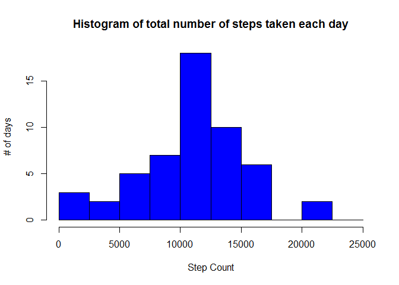
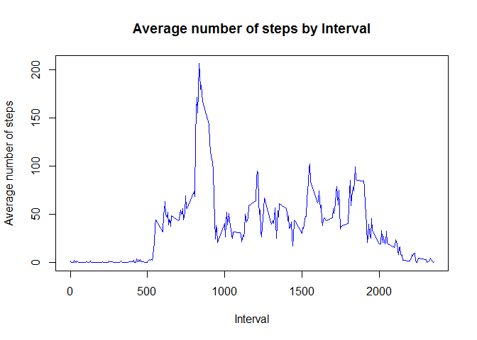
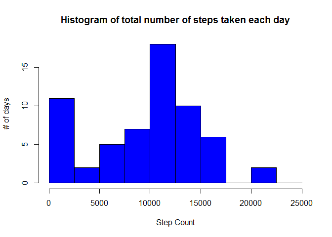
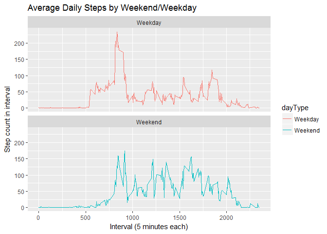

# Reproducible Research: Peer Assessment 1

## Loading and preprocessing the data

### Global Options Setup


```r
knitr::opts_chunk$set(echo = TRUE)
```

### Check if File Exists
- Unzips if file is not unzipped, and downloads zip file if zip file is missing

```r
library(httr)
if(!file.exists("activity.zip")){
     temp = "activity.zip"
     GET("https://d396qusza40orc.cloudfront.net/repdata%2Fdata%2Factivity.zip", write_disk(temp, overwrite=FALSE)); unzip("activity.zip") } else if (!file.exists("activity.csv")){
          unzip("activity.zip")     
     }
```
### Loading the data in
- Change Date to Date class in R, and produce summary of data


```r
activityData <- read.csv("activity.csv", header = TRUE, na = "NA", stringsAsFactors = TRUE)
activityData$date <- as.Date(activityData$date)
summary(activityData)
```

```
##      steps             date               interval     
##  Min.   :  0.00   Min.   :2012-10-01   Min.   :   0.0  
##  1st Qu.:  0.00   1st Qu.:2012-10-16   1st Qu.: 588.8  
##  Median :  0.00   Median :2012-10-31   Median :1177.5  
##  Mean   : 37.38   Mean   :2012-10-31   Mean   :1177.5  
##  3rd Qu.: 12.00   3rd Qu.:2012-11-15   3rd Qu.:1766.2  
##  Max.   :806.00   Max.   :2012-11-30   Max.   :2355.0  
##  NA's   :2304
```

## What is mean total number of steps taken per day?

- Calculate the total number of steps taken per day


```r
stepsbyday <- tapply(activityData$steps, activityData$date, sum)
```
- If you do not understand the difference between a histogram and a barplot, research the difference between them. Make a histogram of the total number of steps taken each day

```r
hist(stepsbyday, main="Histogram of total number of steps taken each day", xlab = "Step Count", ylab = "# of days", breaks = seq(0,25000, by = 2500), col="blue")
```

<!-- -->

Observation: Most of the steps take place in the middle of the day

- Calculate and report the mean and median of the total number of steps taken per day

### Mean Steps by day

```r
mean(stepsbyday, na.rm = TRUE)
```

```
## [1] 10766.19
```
### Median Steps by day

```r
median(stepsbyday, na.rm = TRUE)
```

```
## [1] 10765
```
## What is the average daily activity pattern?

- Make a time series plot (i.e. 𝚝𝚢𝚙𝚎 = "𝚕") of the 5-minute interval (x-axis) and the average number of steps taken, averaged across all days (y-axis)


```r
meanStepsbyInterval <- tapply(activityData$steps, activityData$interval, mean, na.rm=TRUE)
plot(unique(activityData$interval), meanStepsbyInterval, type="l", col="blue", main="Average number of steps by Interval", xlab="Interval",ylab = "Average number of steps")
```

<!-- -->

- Which 5-minute interval, on average across all the days in the dataset, contains the maximum number of steps?


```r
dfInterval <- cbind(unique(activityData$interval), meanStepsbyInterval)
dfInterval <- as.data.frame(dfInterval)
names(dfInterval) <- c("interval","meanSteps")

maxdfInterval <- (c(dfInterval$interval[which.max(dfInterval$meanSteps)],dfInterval$meanSteps[which.max(dfInterval$meanSteps)]))
names(maxdfInterval) <- c("Interval#", "MeanSteps")
maxdfInterval
```

```
## Interval# MeanSteps 
##  835.0000  206.1698
```

## Imputing missing values

Note that there are a number of days/intervals where there are missing values (coded as 𝙽𝙰). The presence of missing days may introduce bias into some calculations or summaries of the data.

- Calculate and report the total number of missing values in the dataset (i.e. the total number of rows with 𝙽𝙰s)


```r
sum(!complete.cases(activityData))
```

```
## [1] 2304
```

- Devise a strategy for filling in all of the missing values in the dataset. The strategy does not need to be sophisticated. For example, you could use the mean/median for that day, or the mean for that 5-minute interval, etc.

## Strategy: Use the Median to replace the NA values

- Create a new dataset that is equal to the original dataset but with the missing data filled in.


```r
#Strategy use the Median values

medianStepsbyInterval <- tapply(activityData$steps, activityData$interval, median, na.rm=TRUE)

dfInterval_median <- cbind(unique(activityData$interval), medianStepsbyInterval)
dfInterval_median <- as.data.frame(dfInterval_median)
#head(dfInterval_median)

#dfInterval_median$medianStepsbyInterval[match(activityData$interval, dfInterval_median$V1)]


act_impute <- transform(activityData, steps = ifelse(is.na(activityData$steps), yes = dfInterval_median$medianStepsbyInterval[match(activityData$interval, dfInterval_median$V1)], no = activityData$steps))
```

- Make a histogram of the total number of steps taken each day and Calculate and report the **mean** and **median** total number of steps taken per day. Do these values differ from the estimates from the first part of the assignment? What is the impact of imputing missing data on the estimates of the total daily number of steps?

### Histogram


```r
stepsbyday_impute <- tapply(act_impute$steps, act_impute$date, sum)
hist(stepsbyday_impute, main="Histogram of total number of steps taken each day", xlab = "Step Count", ylab = "# of days", breaks = seq(0,25000, by = 2500), col="blue")
```

<!-- -->

###Mean


```r
mean(stepsbyday_impute, na.rm = TRUE)
```

```
## [1] 9503.869
```

###Median


```r
median(stepsbyday_impute, na.rm = TRUE)
```

```
## [1] 10395
```

## Are there differences in activity patterns between weekdays and weekends?

- Create a new factor variable in the dataset with two levels – “weekday” and “weekend” indicating whether a given date is a weekday or weekend day.


```r
weekendIndicator <- function(x){
     if (weekdays(x) == "Saturday" | weekdays(x) == "Sunday") {
          y = "Weekend" } 
     else {
          y = "Weekday"
     }
     y
}

activityData$dayType <- sapply(activityData$date, weekendIndicator)
meanstepsbyintervaldaytype <- aggregate(steps~interval+dayType, activityData, mean)
head(meanstepsbyintervaldaytype)
```

```
##   interval dayType     steps
## 1        0 Weekday 2.3333333
## 2        5 Weekday 0.4615385
## 3       10 Weekday 0.1794872
## 4       15 Weekday 0.2051282
## 5       20 Weekday 0.1025641
## 6       25 Weekday 1.5128205
```

- Make a panel plot containing a time series plot (i.e. 𝚝𝚢𝚙𝚎 = "𝚕") of the 5-minute interval (x-axis) and the average number of steps taken, averaged across all weekday days or weekend days (y-axis). See the README file in the GitHub repository to see an example of what this plot should look like using simulated data.


```r
library(ggplot2)
plot <- ggplot(meanstepsbyintervaldaytype, aes(x = interval, y = steps, color = dayType)) + geom_line() + facet_wrap(~dayType, ncol=1, nrow = 2) + labs(title = "Average Daily Steps by Weekend/Weekday", x = "Interval (5 minutes each)", y = "Step count in interval")
print(plot)
```

<!-- -->
